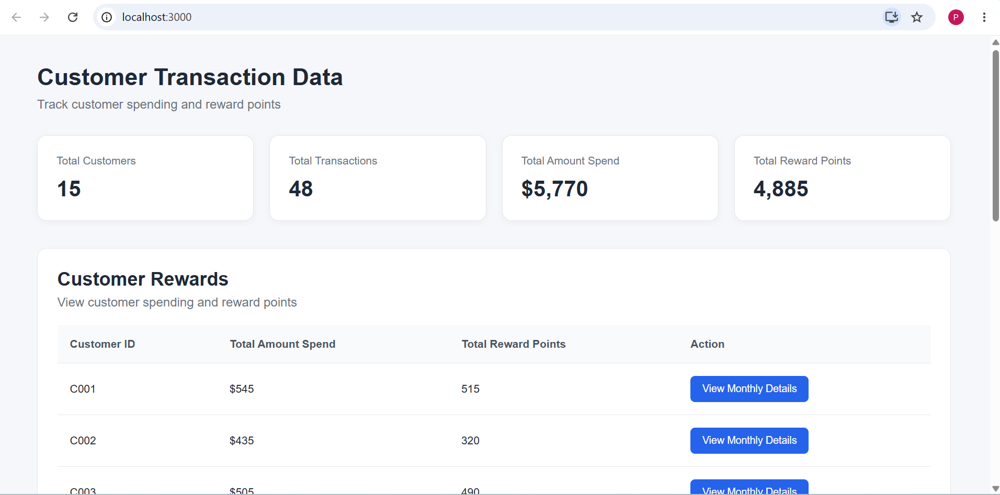
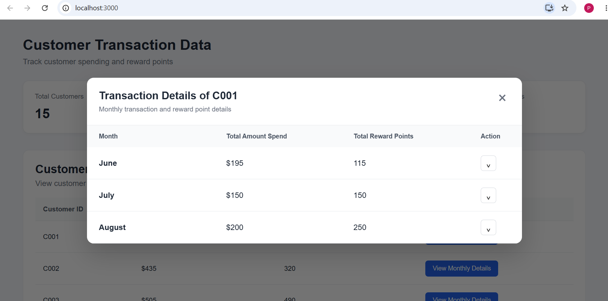
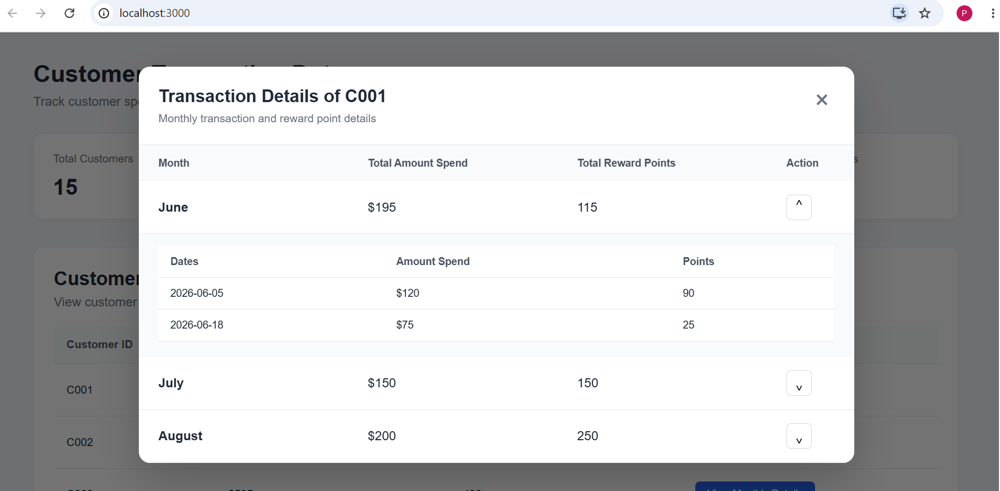
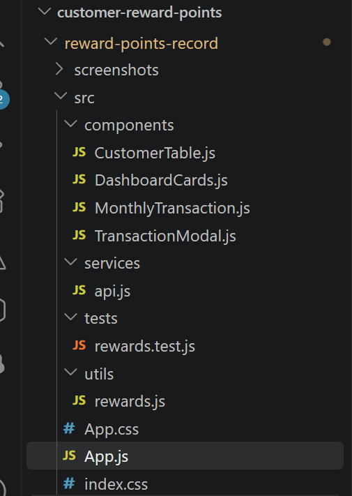
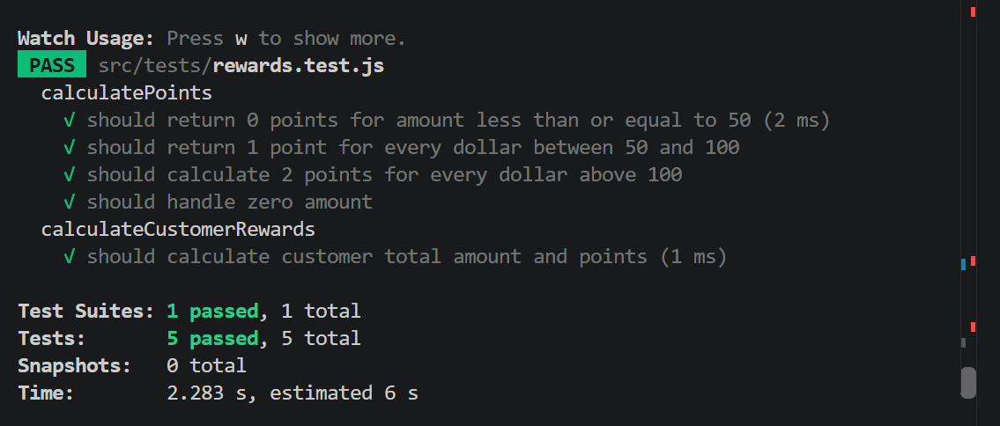

A retailer offers a rewards program to its customers, awarding points based on each recorded purchase.   

A customer receives 2 points for every dollar spent over $100 in each transaction, plus 1 point for every dollar spent between $50 and $100 in each transaction. 

(e.g. a $120 purchase = 2x$20 + 1x$50 = 90 points)

// Rewards Dashboard

// Monthly Dashboard

// Transaction Detail

// Folder structure

// Test cases

